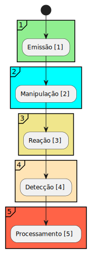
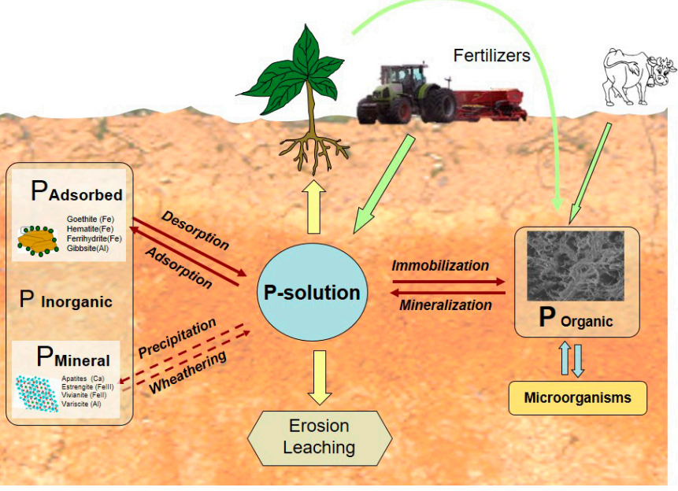

# Elementos Presentes na Espectroscopia
----------------------------

<!--ts-->
  -[Emissao](#Emissao) 
  -[Manipulacao](#Manipulacao) 
  -[Reacao](#Reacao) 
  -[Deteccao](#Deteccao) 
  -[Processamento](#Processamento) 
<!--te-->

## Emissao
------------------
  Diz respeito a fonte geradora de luz.

    -Qual o intervalo de comprimento de onda é o mais adequado?
      *Leds?
      *Tungstênio?
      *Halogênio?
    
    -Como dimencionar os colimadores?
    -Como avaliar a necessidade de se usar um colimador?
    -Quais são as necessidades eletrônicas para se acionar a fonte de luz?
    -`Existe algum parametro óptico que possa ser usado como referência de controle
     para alterar o comportamento da fonte de luz?`

## Manipulacao
------------------
  Trata-se dos processos que fazem uso de difração, foco, colimação, interferência
  da luz proveniente da fonte.
    
    -Como dimencionar os angulos dos espelhos?
    -Como dimencionar as distâncias?
    -Quais propriedades ópticas causam rúido, interferência, perdas?
    -`Vale a pena explorar uma relação de servo motores para aproximar, afastar,
      ou alterar os angulos verticais e horizontais dos espelhos?`
    -Qual fenomeno óptico deve ser mensurado (reflectancia, absorção, difração, turbidez)? 

## Reacao
------------------
<!--ts-->
  -[Referencias_Reacao](#Referencias_Reacao) 
<!--te-->
  Caracteriza-se por descrever o perfil comportamental do fósforo (picos, intervalos de 
  comprimento de onda usados para quantificação).  
    
    -Qual é o perfil espectrométrico do fósforo?
    -Quais são seus picos?
    -Como quantificar ele?

  A caracterização espectral do fósforo presente no solo exige a compreensão das escolhas metodologias que já foram empregadas
  no passado. Quando se observa os trabalhos já desenvolvidos pela literatura é constante a preocupação de se determinar a 
  dinamica do fósforo com os demais compostos presentes no ambiente. Quando [6] discute o ciclo do fósforo nas culturas, ele 
  explica que o P é um elemento altamente reativo e que portanto não é encontrado na sua forma pura.
  Diz-se que o fósforo esta em sua composição **disponivel** ou **soluvel** (Pdisp), quando pode ser absorvdio 
  pelas plantas. Isso acontece quando ele esta da seguintes formas:   
     
  Ortofosfato:      PO4-2, PO4-3 .  
  Acido fosfórico:  H2PO4-1, HPO4-2 .    

  Porém, como foi afirmado anteriormente, estamos analisando um elemento altamente rativo, o que significa que além do Pdisp
  há muitos outros tipos de concentração (também chamadas de **piscina (pool)**). [1] Aborda o ciclo do fósforo no ambiente seprando-o em 4 psicinas. P soluvel Pdisp, P adsovrivdo Pads, P mineral Pmin e P organico Porg. A piscinas e suas respectivas interções são mostradas na Figura 1.  

  
  **Figura 1**. Fonte: Referencia [1].

### Referencias_Reacao
------------------
 
##### [1]: Iron oxides and organic matter on soil phosphorus availability  
  [1]:#sec1

##### [2]: ATR–FTIR Spectroscopic Investigation on Phosphate Adsorption Mechanisms at the Ferrihydrite–Water Interface  
  [2]: #sec2 

##### [3]: Phosphorus speciation and distribution in a variable-charge Oxisol under no-till amended with lime and/or phosphogypsum for 18 years 
  [3]: #sec3 
 
##### [4]: Phosphorus speciation by P-XANES in an Oxisol under long-term no-till cultivation 
  [4]:#sec4

##### [5]: Phosphorus speciation in soils with low to high degree of saturation due to swine slurry application 
  [5]: #sec5 

##### [6]: On the tropical soils; The influence of organic matter (OM) on phosphate bioavailability 
  [6]: #sec6

## Deteccao
------------------
  Elemento(s) utilizados para converter uma grandeza óptica (reflectância, difração, 
  tranmissão, etc) em sinal elétrico.

    -Fotodio? Array de fotodiodos? Outros materiais?
  
  **Depois de responder sobre Emissão, Manipulação e Reação será possivel avaliar**

## Processamento
------------------
  Eletrônica, aloritimos e recuros computacionais (comunicação, RTOS, uC, etc) necessários
  para manipular os sinais elétricos.

    -Quais circuitos serão necessários?
    -Quais processamentos de dados serão necessários (filtros SG, PCA, PLSR)?

  **Designs anteriores e os fundamentos de espectroscopia são o caminho para responder essas perguntas**
