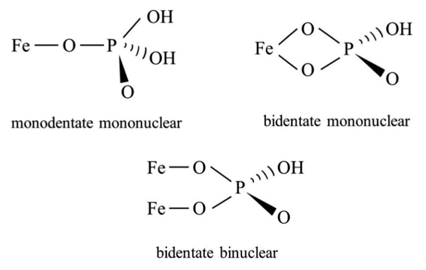

# Elementos Presentes na Espectroscopia 
----------------------------


<!--ts-->
  -[Emissao](#Emissao)<br />
  -[Manipulacao](#Manipulacao)<br />
  -[Reacao](#Reacao)<br />
  -[Deteccao](#Deteccao)<br />
  -[Processamento](#Processamento)<br />
<!--te-->

## Emissao
------------------
  Diz respeito a fonte geradora de luz.

    -Qual o intervalo de comprimento de onda é o mais adequado?
      *Leds?
      *Tungstênio?
      *Halogênio?
    
    -Como dimencionar os colimadores?
    -Como avaliar a necessidade de se usar um colimador?
    -Quais são as necessidades eletrônicas para se acionar a fonte de luz?
    -`Existe algum parametro óptico que possa ser usado como referência de controle
     para alterar o comportamento da fonte de luz?`

## Manipulacao
------------------
  Trata-se dos processos que fazem uso de difração, foco, colimação, interferência
  da luz proveniente da fonte.
    
    -Como dimencionar os angulos dos espelhos?
    -Como dimencionar as distâncias?
    -Quais propriedades ópticas causam rúido, interferência, perdas?
    -`Vale a pena explorar uma relação de servo motores para aproximar, afastar,
      ou alterar os angulos verticais e horizontais dos espelhos?`
    -Qual fenomeno óptico deve ser mensurado (reflectancia, absorção, difração, turbidez)? 

## Reacao
------------------
<!--ts-->
  -[Referencias_Reacao](#Referencias_Reacao)<br />
<!--te-->
  Caracteriza-se por descrever o perfil comportamental do fósforo (picos, intervalos de 
  comprimento de onda usados para quantificação).  
    
    -Qual é o perfil espectrométrico do fósforo?
    -Quais são seus picos?
    -Como quantificar ele?

  A caracterização espectral do fósforo presente no solo exige a compreensão das escolhas metodologias que já foram empregadas
  no passado. Quando se observa os trabalhos já desenvolvidos pela literatura é constante a preocupação de se determinar a 
  dinamica do fósforo com os demais compostos presentes no ambiente. Quando [[6]] discute o ciclo do fósforo nas culturas, ele 
  explica que o P é um elemento altamente reativo e que portanto não é encontrado na sua forma pura.
  Diz-se que o fósforo esta em sua composição **disponivel** ou **soluvel** (P<sub>disp</sub>), quando pode ser absorvdio 
  pelas plantas. Isso acontece quando ele esta da seguintes formas:   
     
  Ortofosfato:      PO<sub>4</sub><sup>-2</sup>, PO<sub>4</sub><sup>-3</sup> .  
  Acido fosfórico:  H<sub>2</sub>PO<sub>4</sub><sup>-1</sup>, HPO<sub>4</sub><sup>-2</sup> .    

  Porém, como foi afirmado anteriormente, estamos analisando um elemento altamente rativo, o que significa que além do P<sub>disp</sub>
  há muitos outros tipos de concentração (também chamadas de **piscina (pool)**). [[1]] Aborda o ciclo do fósforo no ambiente seprando-o em 4 psicinas. P soluvel P<sub>disp</sub>, P adsovrivdo P<sub>ads</sub>, P mineral P<sub>min</sub> e P organico P<sub>org</sub>. As piscinas e suas respectivas interções são mostradas na Figura 1.  

  
  **Figura 1**. Fonte: Referencia [[1]].

  Quando se propõe analisar os Latossolos (Oxisoils) é imporante compreender que 
  tratam-se de solos ácidos (4 < PH < 5.5) e que passaram por longos processo de 
  inteperizaçao. O que significa dizer que há uma grande quantidade de argila e 
  que por isso há uma grande parcela de fósforo imobilizado na forma de P<sub>min</sub>, o também chamado de porção de P não-lábil.
  No contexto das terras tropicais e subtropicais, são os oxidróxidos de Fe, Al e
  Si; presentes na porção de argila que interagem com o P<sub>ads</sub> e P<sub>min</sub>. Os fatores principais que regem essas duas concentrações são PH e matéria
  organica (OM). Seja o P<sub>ads</sub> ou P<sub>min</sub>; do ponto de vista 
  fisico-quimico, ambos são fosfatos (PO<sub>4</sub>) ligados aos oxidróxidos
  de Fe, Al e Si via grupos funcionais (OH) e ions Fe<sup>3+</sup>, Al<sup>3+</sup>, Si<sup>+</sup>.  
  A diferença é o grau de "força" dessas ligações [[7]], pois quando P é lábil diz-se que o P esta adsorvido com algum mineral por meio de uma ligação do tipo **monodentada (monodentate)**. Nesse contexto um oxigênio do fosfato é ligado ao metal.  
  Quando o P é não lábil P<sub>min</sub>, a ligação com os possiveis metais é mais
  forte, portanto, a disponibilidade de P para as plantas é dificultada. Os possivies tipos de ligação são as **bidentadas (bidentates)** ou **binucleadas (binuclear)**. Uma ligação bidentada é tal que dois oxigênios do fosfato são ligados a um metal. Já a binucleada é aquela em que dois oxigênios do fosfato são ligados a dois átomos de metal. A figura 2, proveninte de [[8]] ilustra essas 3 possivies configrações.  
   
  
  **Fgura 2**. Fonte: Referencia [[8]].  
     
  Com essas explicações é intuitivo compreender o porque, quase que a totalidade
  dos estudos que investigam técnicas de quantificar o P<sub>disp</sub> via espectroscopia se preocupam tanto em quantificar o P<sub>ads</sub> em suas abordagens de regressão e interpretação de espectro, uma vez que trata-se um tipo de composto cuja ligação é monodentada. [[1]] e várias outras fontes salietam que o P<sub>ads</sub> mantém uma relação de equilíbrio com o P<sub>disp</sub>, ou seja a porção lábil passa por processos de dessorção a medida que as porção soluvel é reduzida (seja por perda, ou por absorção radicular).
  [[1]], [[3]] e [[4]] são alguns dos muitos trabalhos, os quais afirmam que aumentar o PH (ir de ácidos para básico) e aumentar a OM irão elevar o P<sub>disp</sub>, reduzindo o P<sub>ads</sub>. [[3]] verificou que culturas que sofreram incremento de PH, reduziram a adsorção de P com oxidróxidos de Al, porém não com os de Fe. Ele também identificou que adsorção com Al ocorreu com as formas menos **cristalinas**.  
     
    -Ainda não me é claro o papel da cristalização, não sei se ela eleva a disponibilidade ou a fixação, preciptaçãoainda
    -É possivel quantificar cristalinidade via espectroscopia?   
    
  Em seu trabalho, [[1]] descreve que os grupos funcionais negativamente carregados em substâncias **orgânicas** podem interagir com minerais positivamente carregados, tais como os oxidróxidos de Fe e Al. Ele explica que o aumento da OM cria uma "competição" entre P<sub>ads</sub> e os ions dos compostos organicos, eventualmente reduzindo a adsorção. A OM também inibe o crescimento de cristais. elevando a area de superficie especifica (SSA), reduzindo a difusão do fosfato.  
      
    -Nao entendi o que ele quis dizer com difusão. Acho que relaciona-se com elevação da porsão não lábil.  
 
  Entretanto, esses eventos não são perfeitamente algébricos; sendo melhores explicados via análises e ferramentas estatisticas, pois a OM também  pode fazer surgir as chamadas **pontes de cations**, a qual eleva a concentração de P<sub>ads</sub>, contudo trata-se de uma ligação facilmente reversivel pois é uma ligação de baixa energia, em comparação com as demais explicadas anteriormente. É salientado por [[1]] que a OM em si não gera a dessorção, mas apenas facilita o processo. [[6]] converge em muitos aspectos a [[1]], porém ele adiciona que apesar de proporcionar a redução da porção adsorvida via liberação de fosfatos (acidos, ou não), não significa que haverá uma elevação equivalente em P<sub>disp</sub>, pois há também em jogo os processos de lixiviação e escoamento superificial, as quais são classificadas como perdas na Figura 1 e também a elevação da porção de P<sub>org</sub>.  
    
   Para PHs entre 5 e 8 [[2]] destaca que há baixa concentração de H<sup>+</sup> e que portanto a cocentração de acidos fosfóricos 
( H<sub>2</sub>PO<sub>4</sub><sup>-1</sup> e HPO<sub>4</sub><sup>-2</sup> )são baixas. É por essa razão que o P<sub>disp</sub>
irá se ligar com ions suplementares com a tendência de gerar composotos mais estáveis.  

    -Fatores Para serem levados em consideração  
       *Concentração de oxidróxidos de Fe e Al
                 -> Adsorção de P
                 -> grau de Crisalização
       *Nível de PH
       *Concentração de OM
    -Como gerar uma relação de equilibrio entre FeOx, AlOx, suas respectivas cristalizações, adsorção (ligação monodentada), PH e Matéria Organica???
    -Será que é necessário estimar P não-lábil e Porg?? Ou será que conhecendo a relação de equilibrio entre Pads e Pdisp e a concentração
    de Pads já é possivel obter bons resultados???
  
```diff
-  Aritgos 3 e 4 abordam estratégias de estimar Pdisp, considerando muitos desses aspectos em suas regressões. Entretanto eu ainda não consegui entender muito bem COMO eles organizaram essas ideias e transpareceram elas nas técnicas estatisticas.
```  

````diff
@  Aritgo 5 trata-se de um estudo que investiga o impacto ambiental do ponto de vista da concentração de fósforo. Na sessão 3.1 ele cita o Manual Regional de Fertilidade do Solo, o qual afirma que 18 mg.Kg⁻¹ extraído de Mehlich-1 é considerado nível critico.  
```  
    -Se eu não me engano Mehlich-1 fornece uma estimativa de Pads.  
  
````diff
@  Nos comentários da tabela 4 do Aritgos 4 ele cita 2 trbalhos que afirmam que 10% < NRMSE < 20% é considerado um ajuste bom.  
```
   
  Fazendo uma estimativa um tanto quanto grosseira suponho que uma
  RMSE toleravel flutuaria entre 1,8 e 3,6 mg.kg⁻¹.
  
    -Esses números são razoaveis?   
    -Será que a incerteza poderia ser maior?  
    -Será que a incerteza precisa ser menor??  
      
### Referencias_Reacao
------------------
<a name="sec1"></a> 
##### [1]: Iron oxides and organic matter on soil phosphorus availability <br />
  [1]:#sec1
<a name="sec2"></a>
##### [2]: ATR–FTIR Spectroscopic Investigation on Phosphate Adsorption Mechanisms at the Ferrihydrite–Water Interface <br />
  [2]: #sec2 
<a name="sec3"></a>
##### [3]: Phosphorus speciation and distribution in a variable-charge Oxisol under no-till amended with lime and/or phosphogypsum for 18 years<br />
  [3]: #sec3 
<a name="sec4"></a> 
##### [4]: Phosphorus speciation by P-XANES in an Oxisol under long-term no-till cultivation<br />
  [4]:#sec4
<a name="sec5"></a>
##### [5]: Phosphorus speciation in soils with low to high degree of saturation due to swine slurry application<br />
  [5]: #sec5 
<a name="sec6"></a>
##### [6]: On the tropical soils; The influence of organic matter (OM) on phosphate bioavailability<br />
  [6]: #sec6
<a name="sec7"></a>
##### [7]: O elemento P: formas e dinâmica em solos tropicais<br />
  [7]: #sec7
<a name="sec8"></a>
##### [8]: Phosphorus immobilization in water and sediment using iron-basedmaterials: A review <br />
  [8]: #sec7


## Deteccao
------------------
  Elemento(s) utilizados para converter uma grandeza óptica (reflectância, difração, 
  tranmissão, etc) em sinal elétrico.

    -Fotodio? Array de fotodiodos? Outros materiais?
  
  **Depois de responder sobre Emissão, Manipulação e Reação será possivel avaliar**

## Processamento
------------------
  Eletrônica, aloritimos e recuros computacionais (comunicação, RTOS, uC, etc) necessários
  para manipular os sinais elétricos.

    -Quais circuitos serão necessários?
    -Quais processamentos de dados serão necessários (filtros SG, PCA, PLSR)?

  **Designs anteriores e os fundamentos de espectroscopia são o caminho para responder essas perguntas**
